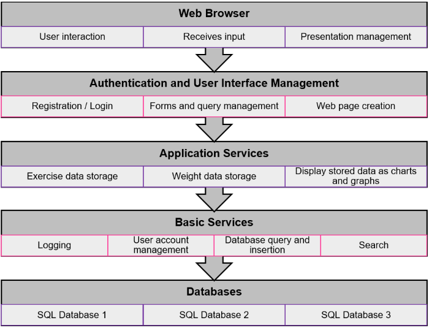
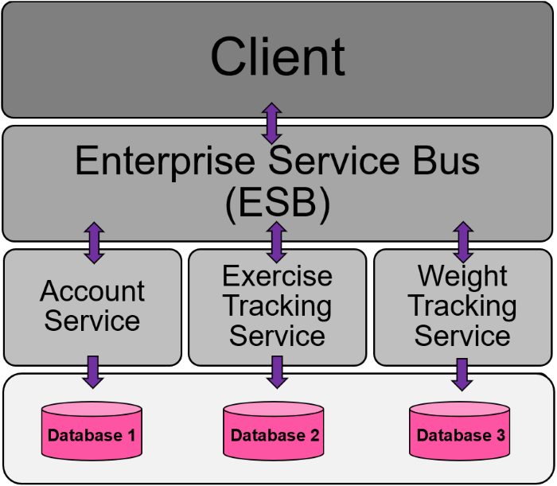
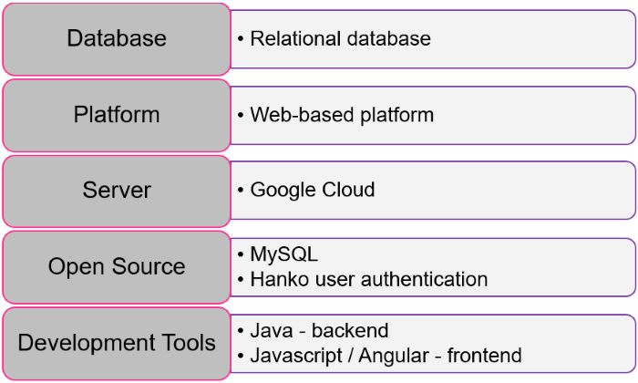

#  **CurlCounters** 

Made with [contrib.rocks](https://contrib.rocks).

## What is the product?
The product we want to develop is a fitness application that 
tracks fitness workouts. The customer inputs their exercises and the 
application will store their workouts and provide a graph of their 
exercises to show progression as they continually train.

## What are the possible names of the product?
	-Fitbotics
	-Lift
	-EnergyPeak
	-Train and Gain
	-BroGainz
	-CountingCurls
	-Sweat Trek
	-Fit Follower
	-Gym Buddy
	-Gym Journal
	-Swole Stats
	-Training Tracker

## Who are the potential customers, end users, or buyers?
	-People trying to lose weight
	-Regular fitness hobbyists trying to track their workouts
	-Fitness gyms and supplement companies looking to advertise
	-Anyone looking to track their workouts and fitness progress 
	effectively

## What are the potential features, functions, or other important details that would be appealing? 
	-Suggests supplements
	-Recommends gyms and trainers near you
	-Provides instructions on performing specific exercises and 
	explains which muscles they affect the most
	-Offers healthy nutrition diets
	-Stores workout exercises and routines

## Our Vision Statement
FOR health enthusiasts WHO need a one-stop-shop for all things fitness, 
THE CountingCurls is a fitness app THAT provides an easy way to track 
fitness goals and progress and receive personalized recommendations. 
UNLIKE other fitness apps, OUR PRODUCT will provide reminder alerts and be 
offered to users at no cost.

#  CountingCurls Architecture 
	
## Architectural Organization
CountingCurls will utilize a layered architecture for its web-based application. 
There will be five layers: Web Browser, Authentication and User Interface Management, Application 
Services, Basic Services, and Databases. Every layer contains a few components that each complete 
their own task and do not overlap. The components are grouped by their similar functionality, making
layers logically coherent. 

## 

## Component Distribution and Communication
CountingCurls will use a service-oriented distribution architecture. Since the services are stateless
components, they can be replicated and migrated from one computer to another – making the application
easier to scale as demand hopefully increases. A service-oriented distribution architecture will also 
work well with the cloud database we plan to run CountingCurls on. All of these features combined will
make it easier for new functionalities to be added in the future. 

## 

## Technologies
**Database**: CountingCurls will be handling simple amounts of data, but the information needs to be 
consistent and accurate; therefore, we will be using a relational database to store data, which 
will support ACID transactions to guarantee our data remains reliable.  

**Platform**: Initially, CountingCurls will be deployed on a web-based platform. This will allow us 
to control the version of CountingCurls that users are running. Users will have immediate access 
to the most up-to-date security and additional features without having to update a mobile app.  

**Server**: CountingCurls will utilize Google Cloud as its server. Using a cloud server will allow 
CountingCurls to scale as it grows and Google provides more discounts than its competitors, which 
is critical for a new software with limited funds.  

**Open Source**: CountingCurls will take advantage of open-source software, such as MySQL as its 
relational database management system, and Hanko as a user authentication service. Reusing these 
software systems instead of writing our own will allow us to reduce development costs and the 
time it takes to get CountingCurls on the market. Also, utilizing Hanko, which authenticates users 
with passcodes instead of passwords, will keep our data secure without burdening our users with 
extreme security hoops to jump through to use our software. 

**Development Tools**: CountingCurls will be written using Java on the backend and Javascript and 
Angular for the frontend. 

## 